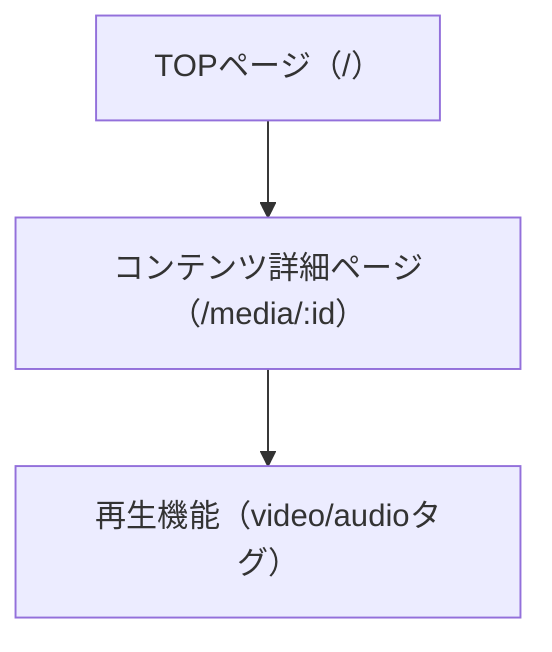
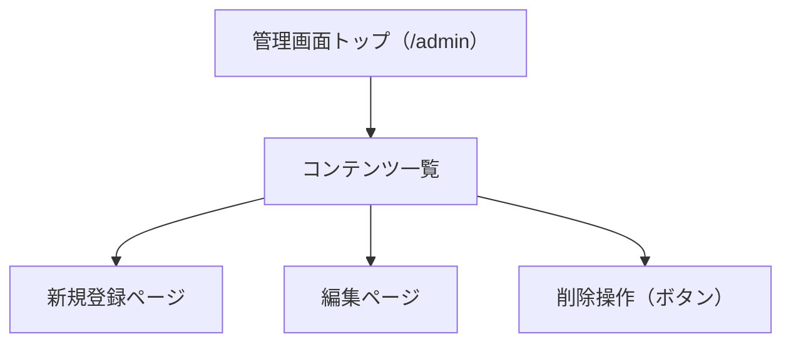

# 画面遷移図

## ユーザ向け

```mermaid
graph TD
  Top[TOPページ（/）] --> Detail[コンテンツ詳細ページ（/media/:id）]
  Detail --> Player[再生機能（video/audioタグ）]
```

## 管理者向け

```mermaid
graph TD
  AdminTop[管理画面トップ（/admin）] --> List[コンテンツ一覧]
  List --> New[新規登録ページ]
  List --> Edit[編集ページ]
  List --> Delete[削除操作（ボタン）]
```
